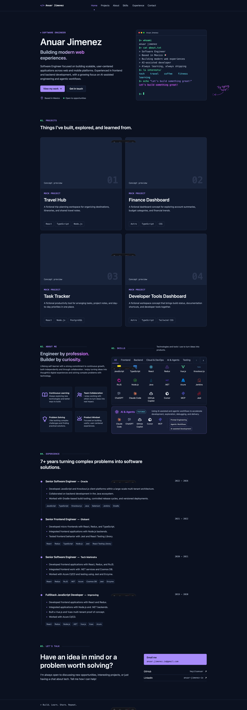

# Anuar Jimenez — Portfolio

Personal portfolio for Anuar Jimenez, built as a fast, accessible static site.

[](https://heyitsanuar.github.io/portfolio-web-client/)

**Live site:** [heyitsanuar.github.io/portfolio-web-client](https://heyitsanuar.github.io/portfolio-web-client/)

## Built with

- Astro 7
- TypeScript
- Tailwind CSS 4
- GitHub Pages and GitHub Actions

## Local development

Requires Node.js `>=22.12.0` (the repository specifies `24.19.0` in `.nvmrc`) and npm.

```sh
npm ci
npm run dev
```

Available checks:

```sh
npm run check
npm run build
npm run preview
```

## Contact

- [GitHub](https://github.com/heyitsanuar)
- [LinkedIn](https://www.linkedin.com/in/anuar-jimenez-io/)
- [Email](mailto:anuar.jimenez.io@gmail.com)
